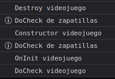

# AngularTesting

This project was generated with [Angular CLI](https://github.com/angular/angular-cli) version 14.2.6.

## Development server

Run `ng serve` for a dev server. Navigate to `http://localhost:4200/`. The application will automatically reload if you change any of the source files.

## Code scaffolding

Run `ng generate component component-name` to generate a new component. You can also use `ng generate directive|pipe|service|class|guard|interface|enum|module`.

## Build

Run `ng build` to build the project. The build artifacts will be stored in the `dist/` directory.

## Running unit tests

Run `ng test` to execute the unit tests via [Karma](https://karma-runner.github.io).

## Running end-to-end tests

Run `ng e2e` to execute the end-to-end tests via a platform of your choice. To use this command, you need to first add a package that implements end-to-end testing capabilities.

## Further help

To get more help on the Angular CLI use `ng help` or go check out the [Angular CLI Overview and Command Reference](https://angular.io/cli) page.

# Notes

## Component

### Creacion de componente

Para generar un componente se puede utilizar el comando `npm run ng g component <componente>`

### Constructor anidado

Ver [Zapatilla](src/app/models/zapatilla.ts) para ver como ahorrar lineas de codigo en el constructor si el nombre de la propiedad y del parametro del constructor son iguales

---

## Hooks

### OnInit

Se ejecuta al iniciar el componente pero despues del constructor

### DoCheck

Se ejecuta despues de modificar cualquier componente

### OnDestroy

Se ejecuta antes de destruir un componente

---

## Directivas

- **\*ngIf:** Pintara la etiqueta si cumple la condicion.
- **\*ngFor="let \<var> of \<Array>":** ForEach en etiquetas.
- **\*ngFor="let \<var> of \<Array>; let \<indice> = index":** Se puede acceder al valor del indice mediante la variable definida <indice>.
- **[ngStyle]:** Crear atributo Style.
- **[style.<property>]:** Introduce a la etiqueta la \<property> declarada.
- **[ngSwitch]="\<var>":** Un switch tipo java.
  - **\*ngSwitchCase="\<value>":** case tipo java.
- **[\<atributo>.\<valor>]="\<boolean>":** introduce un \<atributo> con el \<valor> especificado.
- **[ngClass]="[\<class1>, \<class2>]":** insertes las clases especificadas
  -- **[ngClass]="{'\<class1>': \<boolean1>, '\<class2>': \<boolean2>}":** Insertara las clases si se cumplen las condiciones.

---

## Two way data-binding

Para usar el ngModel se necesita importar el `FormsModule` en el [app.module.ts](src/app/app.module.ts) y anadirlo en el array de imports

- **[(ngModel)]:** hara referencia a la propiedad del componente

---

## Eventos

- **(click)**
- **(blur)**
- **(keyup.enter)**
